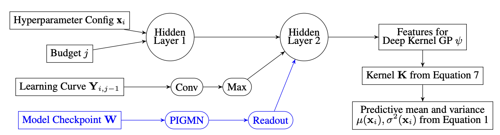

# Improving Hyperparameter Optimization with Checkpointed Model Weights



Codebase for the NVIDIA paper [Improving Hyperparameter Optimization with Checkpointed Model Weights](https://research.nvidia.com/labs/toronto-ai/FMS/). We develop a method for finding the best model and hyperparameters for finetuning efficiently. We use a deep Gaussian process kernel with a permutation equivariant graph neural network as a feature extractor.

**Authors:** Nikhil Mehta, Jonathan Lorraine, Steve Masson, Ramanathan Arunachalam, Zaid Pervaiz Bhat, James Lucas, Arun George Zachariah

## Navigating the Codebase

`/dataset` contains scripts for generating training data and provides tools to interface with the loaded data.

`/experiments` contains scripts for running FMS.  `fms.py` is the main experiment script with lots of configurations.

`/experiments/scripts` contains scripts to run `fms.py` with configurations used to generate the figures in the paper.

After running the experiment, the results are saved in `/experiments/results`, and you can run the plot generation scripts to recreate the figures in the paper.

## Installation

```bash
cd fms-clean
pip install -e .
```

If you're using CUDA, make sure you install `pytorch`, `torch_scatter`, and `torch_geometric` using the right CUDA version.

## Citation

If you find this code useful, please consider citing it:

```bib
@article{mehta2024fms,
  title={Improving Hyperparameter Optimization with Checkpointed Model Weights},
  author={Nikhil Mehta and Jonathan Lorraine and Steve Masson and Ramanathan Arunachalam and Zaid Pervaiz Bhat and James Lucas and Arun George Zachariah},
  journal={arXiv preprint arXiv:TODO},
  url={https://arxiv.org/abs/TODO}
  year={2024},
}
```